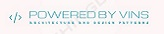

# Архитектура и шаблоны проектирования на Python
*4 четверть курса Python разработки от университета GeekBrains*

[](https://github.com/GregoryVins/Architecture-and-design-patterns)

------
### Урок 1
- Начало разработки своего WSGI framework
- Использование классических паттернов page controller и front controller (Возможность отвечать на get запросы пользователя)
- Рендеринг страниц с помощью шаблонизатора jinja2
- Добавление двух демонстрационных html страниц (index, contacts) нерабочие urls рендерят 404 ошибку

### Урок 2
- Добавлена возможность обработки post запроса
- Добавена возможность получения данных из post запроса
- Дополнительно добавлена возможность получения данных из get запроса
- Добавлена форма отправки на html страницу *contacts* (тема сообщения, текст, email)
- Сохранение отправленых данных через форму в временный файл *temporary.txt*
------

### Установка и запуск

**Установка зависимостей:**
```
$ pip install uwsgi
$ pip install jinja2
```
**Запуск:**

Переходим в папку, где расположен файл main.py
```
$ uwsgi --http :8000 --wsgi-file main.py
```